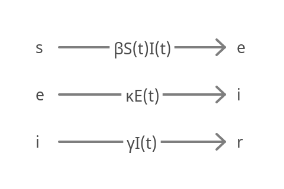

/badge.svg)
/badge.svg)
[](https://codecov.io/gh/SABS-R3-Epidemiology/seirmo)
[](https://seirmo.readthedocs.io/en/latest/?badge=latest)


## General Information
This program models the outbreak of an infectious disease with the SEIR model. The SEIR model is a compartmental model with four compartments: susceptible (S), exposed (but not yet infectious) (E), infectious (I), and recovered (R). Each individual is in one compartment at a time, and different rates quantify the movement of an individual from one compartment to another. 

Two submodels are defined in the program: a deterministic SEIR model and a stochastic SEIR model. Both are non-spatial and are time dependant. When the population size is small, the emergent behaviour of the two systems (deterministic and stochastic) can significantly differ. When the population size is larger, the dynamics tend to better align.


&nbsp;


## Deterministic SEIR
The deterministic model supposes that the population is large and well-mixed, and that small fluctuations in compartments do not impact the general solution. The conceptualisation of the model is illustrated below, and the parameters are described in a table below.


| Parameter     | Description                                                                             | Unit |
| ------------- | --------------------------------------------------------------------------------------- | ---- |
| β             | Percentage of infectious and susceptible encounters per day that lead to transmission   | 1/t  |
| κ             | Inverse of the average latent period                                                    | 1/t  |
| γ             | Inverse of the average duration of infectiousness                                       | 1/t  |

β > 0 controls the rate of transmission, κ > 0 the rate at which exposed individuals become infectious, and γ > 0 the rate at which individuals recover. The model also requires initial conditions for each compartment: S(0), E(0), I(0), and R(0), which represent the initial number of people in each category.


The deterministic model solves this set of ODEs: 


The system of ODEs is nonlinear and must be solved by numerical integration methods. It is solved here using a forward model, using the `solve_ivp` method in the `scipy.integrate` library.


&nbsp;


## Stochastic SEIR
The stochastic model also supposes that the population is homogeneous, but it supposes that small fluctuations in compartments count toward the general solution. It models the population discretely and allows stochastic movements between compartments. The model can be illustrated as a set of chemical reactions:



The model is solved using the Gillespie algorithm (see documentation here: https://en.wikipedia.org/wiki/Gillespie_algorithm). The timesteps are sampled randomly. At each timestep, only one reaction takes place, and which reaction takes place is determined randomly following their propensities. For example, for a given time t, if the reaction occurring is a susceptible individual becoming exposed, then the following changes occur in the densities:


where _(t+1)_ is the next timestep. 


&nbsp;


## Installation procedure
One way to install the module is to download the repository to your machine of choice and type the following commands in the terminal.
```bash
git clone https://github.com/SABS-R3-Epidemiology/seirmo.git
cd ../path/to/the/file
```

A different method to install this is using `pip`:

```bash
pip install -e .
```

&nbsp;

## Documentation 
Some documentation on the program's classes and methods can be found here: https://seirmo.readthedocs.io/en/latest/

### References
List of resources that can be useful for the project:
* Gillespie D, 1977. Exact stochastic simulation of coupled chemical reactions (https://doi.org/10.1021/j100540a008)
* Erban R, Chapman J and Maini P, 2007. A practical guide to stochastic simulations of reaction-diffusion processes (https://arxiv.org/abs/0704.1908)
* Bauer F, 2008. Compartmental models in epidemiology (https://link.springer.com/chapter/10.1007/978-3-540-78911-6_2).

